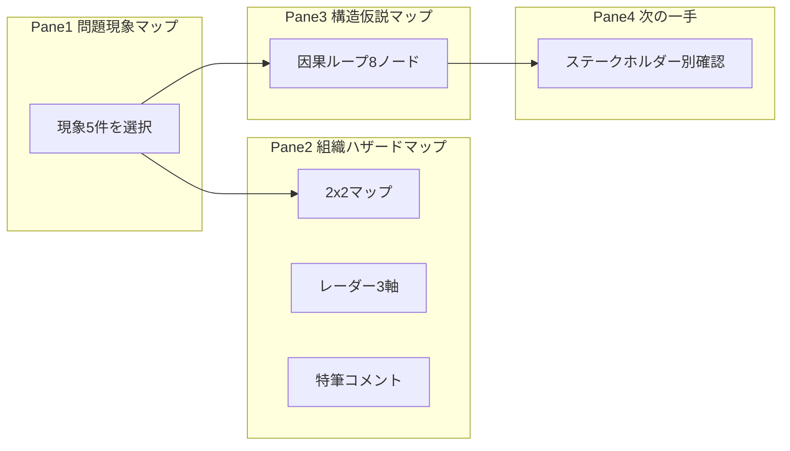

# 組織変革コンサルタントの思考OS — 提出用設計書

**案件名（デモ）：** 中堅製造業 A社  
**ツール名（仮）：** 構造発見ワークスペース  
**スコープ：** v1 バランス型（表側のみ・1案件固定・Pane1選択連動）

---

## 1. ツール概要

組織変革コンサルタントが日々行う **「現象の把握 → 危険の見極め → 構造仮説 → 次の一手」** を、4ペイン1画面で同時に行うためのワークスペース。

- **問題管理ツールではない。** チケットの消化や KPI ダッシュボードの代替ではない。
- **構造発見ツール。** 目に見える現象の背後にある風土・設計・社会背景を、因果ループとして可視化する。
- **Pane1で現象を選ぶと、Pane2（ハザード）・Pane3（構造）・Pane4（介入）が同じ焦点で連動する。**

### 同時に見たい3つ

| # | 視点 | ペイン |
|---|------|--------|
| 1 | **どこが危ないか**（優先度・介入規模） | Pane2 |
| 2 | **なぜ続くか**（構造・悪循環） | Pane3 |
| 3 | **次に誰に何を確認するか** | Pane4 |

Pane1は **「今、どの現象にフォーカスするか」** を決める入口。

---

## 2. 解決する課題

### 誰の課題か

組織変革に関わる **コンサルタント**（およびトップ・ナンバー2への「観方・視点」の提供を行う立場）。

### 何が困るか

組織問題は個人の問題ではなく、**風土・文化・見えにくい背景・社会的潮流** まで絡む。  
既存ツール（スプレッドシート、ロジックツリー、汎用プロジェクト管理）では次が同時に見えない。

- 目に見える **現象**（離職、会議の押し付け合い 等）
- **どれだけ危険か・どの規模で介入すべきか**
- **なぜその現象が続くか**（生態系・悪循環）
- **明日、誰に何を聞くか**

画面や資料を行ったり来たりすると、**「今どこを見るべきか」** が失われ、構造議論が研究化する。

### このツールがすること

> 1つの案件（A社）について、**選んだ現象**を起点に、危険の地図（Pane2）と構造仮説（Pane3）と次の一手（Pane4）を **1画面で連動表示** し、トップや現場への **観方** を渡す。

### 既存ツールとの差（90→100）

| 既存（90点） | 自作（100点） |
|--------------|---------------|
| 表・ツリー・スライドが別々 | **現象選択 → 地図 → ループ → 一手** が切れない |
| 診断軸が散在 | **6軸＋四象限** で介入規模（対症↔構造）まで一枚 |
| 原因は縦に並ぶ | **因果ループ** で悪循環とレバレッジが見える |

---

## 3. 4ペイン構成



| ペイン | 名称 | 役割 | 重み |
|--------|------|------|------|
| **Pane1** | 問題現象マップ | 観察可能な事象の棚。1件選択 | 補助（折りたたみ可） |
| **Pane2** | 組織ハザードマップ | 危険度・優先度・介入規模 | **主役** |
| **Pane3** | 構造仮説マップ | 因果ループ・レバレッジ | **主役** |
| **Pane4** | 次の一手 | レバレッジに紐づく確認事項 | 補助（折りたたみ可） |

---

### Pane1 — 問題現象マップ（確定）

#### 載せるもの / 載せないもの

| 載せる | 載せない（Pane3へ） |
|--------|---------------------|
| 組織内で観察・ヒアリングできる事象 | なれ合い、先送り、やった者負け |
| クライアントが「起きている」と言えること | コンプラ＝免罪符 等の構造仮説 |

#### UI

- **縦リスト**（5件固定）。各行：**種別タグ ＋ 現象名 ＋ 1行メモ**
- **1件のみ選択**（初期選択：**若手離職**）
- 選択行は背景強調。クリックで Pane2/3/4 連動
- v1：**追加・削除UIなし**（JSON固定）

#### 現象一覧（A社デモ）

| ID | 種別 | 現象名 | 1行メモ | Pane3強調 |
|----|------|--------|---------|-----------|
| `young-turnover` | 現象 | **若手離職** | 3年以内離職率が業界平均を上回る | **全ノード（主ループ）** |
| `engagement` | 現象 | エンゲージメント低下 | 調査スコア2年連続ダウン | P1, C1 |
| `order-only` | 違和感 | 言われたことしかやらない | 指示待ち・提案が出ない | S3, C1 |
| `meeting-shirk` | 嫌な事象 | 会議での責任・仕事の押し付け合い | 決まらない・持ち帰りが多い | S1, C2, **L1** |
| `mid-career-burnout` | 不具合 | 中堅層の育成疲弊 | 「育てても評価されない」声 | C1（関連） |

**種別タグ：** 現象 / 不具合 / 違和感 / 嫌な事象 — Pane1での整理用。Pane2以降のロジックには影響しない。

---

### Pane2 — 組織ハザードマップ（確定）

#### 2×2 マップ

| 視覚 | 診断軸 |
|------|--------|
| **横軸**（左→右） | **根深さ**：対症療法で足りる → 構造改革が必要 |
| **縦軸**（下→上） | **影響範囲**：局所 → 全社 |
| **点の大きさ** | **緊急度** |
| **強調** | Pane1 選択中の現象（リング＋ラベル） |

#### 四象限（名称確定）

| 位置 | 名称 | 介入の含意 |
|------|------|------------|
| 左下 | **局所現象** | 現場改善・様子見 |
| 左上 | **重要だが解きやすい** | 制度・運用の手当て |
| 右下 | **根深いが限定的** | 限定範囲の構造改革 |
| 右上 | **本質問題** | 構造仮説・レバレッジの主戦場 |

#### 6診断軸（1〜5点）

| 軸 | マップ/レーダー | 定義（要約） |
|----|-----------------|--------------|
| 緊急度 | 点の大きさ | 放置したときの時間的危険 |
| 影響範囲 | 縦軸 | 問題の波及の広さ |
| 根深さ | 横軸 | 対症 vs 構造・風土まで必要か |
| 責任明確性 | レーダー | 誰が決め・誰が動くか（高＝危険） |
| 変革推進度 | レーダー | 組織の本気度（**高＝良い・他軸と極性逆**） |
| 心理的安全性 | レーダー | 本音・対立を扱えるか（高＝危険） |

**特筆コメント欄：** 6軸外（例：「コンプラが免罪符として機能している声あり → Pane3 S4」）

#### 若手離職のスコア（ヒーローキャプチャ用）

| 軸 | 点数 | 効き |
|----|------|------|
| 影響範囲 | 5 | 上（全社） |
| 根深さ | 5 | 右（構造改革） |
| 緊急度 | 4 | 点・大 |
| 責任明確性 | 5 | レーダー外側 |
| 変革推進度 | 2 | レーダー内側（低い＝危険） |
| 心理的安全性 | 4 | レーダー外側 |

→ **右上・大きい点 ＝ 本質問題**

#### 他現象のマップ位置（概略）

| 現象 | 象限目安 |
|------|----------|
| 若手離職 | 本質問題 |
| エンゲージメント低下 | 本質問題付近 |
| 会議の押し付け合い | 本質問題 |
| 言われたことしかやらない | 根深いが限定的 |
| 中堅の育成疲弊 | 重要だが解きやすい |

#### Pane2 ↔ Pane3 連動

- **根深さ ≥ 4** または **右半分（構造改革側）** のとき、Pane3 の **◇構造ノード** を強調（opacity 100%）。それ以外は 70%。
- **S4（コンプラ仮説）** は常に 40%（5秒ルールのため視界の端）。

---

### Pane3 — 構造仮説マップ（確定）

#### 凡例

| 記号 | 種別 | 線 |
|------|------|-----|
| **□** | 現象 | 実線枠・最大 |
| **○** | 原因 | 実線枠 |
| **◇** | 構造 | 点線枠 |
| **★** | レバレッジ | 強調色・太枠 |
| 太い実線（＋） | 観察済み・強化 | |
| 細い点線 | 仮説 | |
| 太い点線（－） | ★からの抑制 | |

#### ノード（8個）

| ID | 記号 | ラベル |
|----|------|--------|
| P1 | □ | 若手離職 |
| C1 | ○ | 育成機会・裁量の不足 |
| C2 | ○ | 会議での責任押し付け |
| S1 | ◇ | 責任曖昧（組織設計） |
| S2 | ◇ | 先送り・なれ合い |
| S3 | ◇ | やった者負け |
| S4 | ◇ | コンプラ＝免罪符（仮説） |
| L1 | ★ | 会議での決裁・役割の明示 |

#### 主ループ（30秒）

```
S1 責任曖昧 ──(＋)──→ C2 会議で押し付け ──(＋)──→ C1 育成不足 ──(＋)──→ P1 若手離職
```

#### 構造の支え（1分・点線）

```
S2 先送り・なれ合い ──→ C2
S3 やった者負け ──→ C1
S1 ──→ S2
S4 ──→ S2  （仮説・最薄）
```

#### レバレッジ

```
L1 会議での決裁・役割の明示 ──(－)──→ C2
L1 ──(－)──→ S1  （弱）
```

#### Pane1連動

- マップ本体は **若手離職案件で1枚共通**
- 選択現象に応じて **関連ノード・矢印のみ強調**（上表「Pane3強調」列）
- 非関連は opacity 30%

---

### Pane4 — 次の一手（確定）

#### 原則

- **Pane3 の ★（レバレッジ）に紐づく確認事項だけ** を出す（機能追加しない）
- 列：**誰に｜何を確認するか｜ねらい**
- 行数：**2〜3行**（読み切れる量）。v1 編集は最小（静的JSON）

#### ヘッダー

選択中現象名 ＋ レバレッジ名を1行表示：

> フォーカス：**若手離職** — レバレッジ：★ 会議での決裁・役割の明示

#### 現象別の表示内容

##### 若手離職（デフォルト・ヒーロー）

| 誰に | 何を確認するか | ねらい |
|------|----------------|--------|
| **課長** | 会議で「誰が決めるか」が明示されているか。持ち帰りで終わる会議は月何回か | ★レバレッジの実態把握 |
| **部長** | 若手に裁量・育成機会を渡している具体例。評価に反映されているか | C1 育成不足の検証 |
| **トップ** | 「決めないこと」を組織として許していないか。責任の所在をどう定義するか | S1 責任曖昧の打破 |

##### 会議での押し付け合い

| 誰に | 何を確認するか | ねらい |
|------|----------------|--------|
| **課長** | 会議のアジェンダと決裁ルール。越境問題の止め方 | ★ L1 への直行 |
| **ナンバー2** | 部門間の決裁が滞留している事例 | S1・S2 の可視化 |

##### 言われたことしかやらない

| 誰に | 何を確認するか | ねらい |
|------|----------------|--------|
| **課長** | 挑戦と失敗への反応。やった者負けのエピソード | S3 の検証 |
| **担当者** | 自分の判断で動いた経験の有無 | C1 への逆接 |

##### エンゲージメント低下

| 誰に | 何を確認するか | ねらい |
|------|----------------|--------|
| **部長** | 調査結果と現場の本音のギャップ | P1・C1 への接続 |
| **課長** | 若手の仕事設計・成長実感 | 主ループの手前 |

##### 中堅の育成疲弊

| 誰に | 何を確認するか | ねらい |
|------|----------------|--------|
| **部長** | 育成時間の確保と評価の一貫性 | C1 関連 |
| **中堅（担当）** | 「育てても損をする」と感じる理由 | 特筆コメントの深掘り |

#### Pane4 で v1 やらないこと

- 全ステークホルダー6種を常時表示（行が増えすぎる）
- タスク管理・期限・完了チェック

---

## 4. 工夫したポイント

1. **現象選択で4ペインが連動**  
   Pane1で「若手離職」を選ぶと、Pane2で本質問題域に点が浮き、Pane3で主ループが強調され、Pane4で★に直結するヒアリングが出る。**「今どこを見るべきか」** が1クリックで決まる。

2. **Pane2を「表」ではなく「地図」にした**  
   横軸＝根深さ（対症↔構造改革）、縦軸＝影響範囲、サイズ＝緊急度。四象限名で **介入規模** まで一目。レーダーは責任・変革推進度・心理的安全性で **介入しやすさ** を補完。

3. **Pane3を「木」ではなく「生態系」にした**  
   □○◇★ で役割を分離。主ループ4本で30秒、点線の◇で1分。**★は1か所**に絞り、Pane4へ接続。

4. **引き算**  
   層フィルタ・複数案件・ループ図ドラッグ・永続保存は v1 不採用。Pane4は2〜3行。採用例と同型で **迷いを減らす** 方向。

5. **6軸＋コメント**  
   診断軸は6本に固定しつつ、コンプラ免罪などは **特筆コメント → Pane3 S4** へ逃がし、軸の肥大化を防いだ。

---

## 5. 苦戦したポイント

1. **何を作らないか**  
   汎用テンプレ・3業種同梱・層フィルタ（個人/文化/社会）は研究化するため v1 見送り。**1案件・若手離職主ループ** に絞った。

2. **Pane1とPane2の役割**  
   両方「現状」に見えやすい。Pane1＝**観察可能な入口**、Pane2＝**診断済みの地図** と分け、選択連動で一本化。

3. **Pane2の軸設計**  
   緊急度×影響の一般マトリクスではなく、**根深さ×影響** で「構造改革が必要か」を横軸に置いた。変革推進度だけ **高い＝良い** と極性が逆になるため、レーダー表示で明示。

4. **AIが「便利なUI」に逃げる**  
   表・モーダル・鉛筆編集を提案されがち。**地図・ループ・インライン** を仕様で先に固定した。

5. **Pane3のノード数**  
   全部つなげたくなる。**8ノード・主ループ1本・★1つ** が、5秒/30秒/1分の読み取りと両立する上限だった。

---

## 6. 発表用1分説明

> 私が作ったのは、組織変革コンサルタントの **思考OS** です。問題を管理するのではなく、**問題を生む構造を見つける** ための画面です。
>
> 左の Pane1 で「若手離職」など、**目に見える現象** を選びます。真ん中の Pane2 が **組織ハザードマップ** です。縦軸は影響範囲、横軸は根深さ、点の大きさは緊急度。右上の **本質問題** にあるほど、構造改革が必要です。若手離職はここに来ます。下のレーダーでは、責任明確性や心理的安全性など、**介入しやすさ** を見ます。変革推進度だけは、高いほど良い方向です。
>
> 右の Pane3 では、ロジックツリーではなく **因果ループ** です。責任曖昧から会議の押し付け、育成不足、離職へつながる **悪循環の背骨** を描きます。星マークが **レバレッジ** — 会議での決裁と役割の明示です。
>
> 一番右の Pane4 では、課長へのヒアリングなど **次の一手** につなげます。
>
> 既存の診断表と違い、**現象を選ぶと、危険の地図と構造が同時に連動する** ので、「今どこを見るべきか」が一画面で分かるようにしました。

---

## 7. 実装仕様

### 7.1 技術スタック

- Next.js / TypeScript / Tailwind CSS / shadcn/ui
- ベース：[components/workspace/Workspace.tsx](components/workspace/Workspace.tsx) 4ペインひな形
- データ：v1 は JSON 固定 ＋ セッション内 state（永続化不要）
- Pane2 チャート：shadcn Chart（Scatter ＋ Radar）

### 7.2 レイアウト

- Pane2・Pane3：**幅広**（主役）
- Pane1・Pane4：補助。**Sidebar 折りたたみ** 可
- GlobalHeader：案件名「A社 — 組織変革」

### 7.3 連動ロジック

```
selectedPhenomenonId: string  // 初期 "young-turnover"

onSelect(id):
  → Pane2: 該当スコアで点位置・レーダー更新、選択点強調
  → Pane3: highlightNodeIds / dim others
  → Pane4: 該当 rows を表示
  → 根深さ>=4 or rootDepthX >= 50% → structure nodes emphasis
```

### 7.4 データファイル（案）

```
data/
  case-a-company.json      # 案件メタ
  phenomena.json           # Pane1 5件 + 各6軸スコア + comment
  structure-map.json       # Pane3 nodes + edges + highlightsByPhenomenonId
  next-actions.json        # Pane4 rowsByPhenomenonId
```

### 7.5 Pane1 JSON スキーマ（例）

```json
{
  "id": "young-turnover",
  "category": "現象",
  "label": "若手離職",
  "note": "3年以内離職率が業界平均を上回る",
  "scores": {
    "urgency": 4,
    "impact": 5,
    "depth": 5,
    "accountability": 5,
    "transformationProgress": 2,
    "psychologicalSafety": 4
  },
  "comment": "コンプラが免罪符として機能している声あり（Pane3 S4）",
  "pane3Highlight": ["P1", "C1", "C2", "S1", "S2", "S3", "L1"]
}
```

### 7.6 Pane3 JSON スキーマ（例）

```json
{
  "nodes": [
    { "id": "P1", "type": "phenomenon", "label": "若手離職" },
    { "id": "L1", "type": "leverage", "label": "会議での決裁・役割の明示" }
  ],
  "edges": [
    { "from": "S1", "to": "C2", "kind": "reinforce", "strength": "primary" }
  ],
  "primaryPath": ["S1", "C2", "C1", "P1"],
  "highlightsByPhenomenonId": {
    "young-turnover": ["P1", "C1", "C2", "S1", "S2", "S3", "L1"],
    "meeting-shirk": ["S1", "C2", "L1"]
  }
}
```

### 7.7 Pane4 JSON スキーマ（例）

```json
{
  "young-turnover": {
    "leverageLabel": "会議での決裁・役割の明示",
    "rows": [
      {
        "stakeholder": "課長",
        "question": "会議で「誰が決めるか」が明示されているか。持ち帰りで終わる会議は月何回か",
        "intent": "★レバレッジの実態把握"
      }
    ]
  }
}
```

### 7.8 ヒーローキャプチャ条件（提出・発表用）

| ペイン | 状態 |
|--------|------|
| Pane1 | **若手離職** 選択 |
| Pane2 | 右上・大きい点・本質問題域 |
| Pane3 | 主ループ ＋ ★ L1 が画面中央 |
| Pane4 | 課長行が見える |

### 7.9 v1 スコープ外（再掲）

- 複数案件切替、現象の追加UI、ループ図ドラッグ、DB保存、層フィルタ

### 7.10 実装順序

1. JSON 固定データ作成  
2. Pane2（Scatter ＋ Radar ＋ コメント）  
3. Pane3（SVG 因果ループ ＋ 凡例）  
4. 連動 state  
5. Pane1 リスト ＋ Pane4 テーブル  
6. ヒーローキャプチャ → 図解提出  

---

## 改訂履歴

| 日付 | 内容 |
|------|------|
| 2026-06-03 | Pane2・Pane3 確定。Pane1・Pane4 最終調整。提出用初版 |
